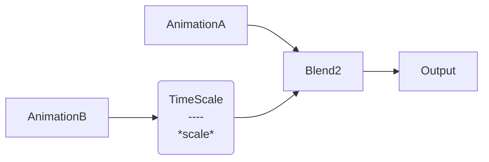
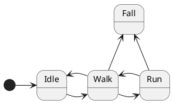
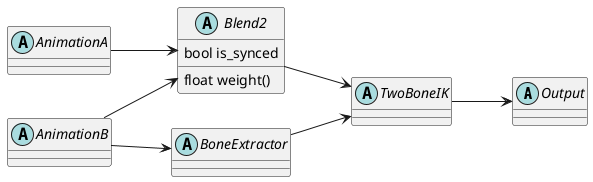
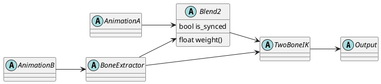
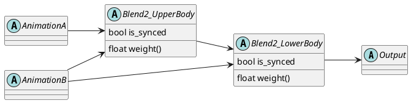
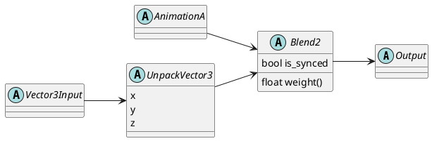

# AnimationGraph

## Animation and Animation Data

For Godot an Animation has multiple tracks where each Track is of a specific type such as "Position", "Rotation", "
Method Call", "Audio Playback", etc. Each Track is associated with a node path on which the value of a sampled Track
acts.

Animation Data represents a sampled animation for a given time. For each track in an animation it contains the sampled
values, e.g. a Vector3 for a position, a Quaternion for a rotation, a function name and its parameters, etc.

A skeletal animation in Godot is specified by a set of animation Tracks that influence the position, rotation, and/or
scale of a bone in a skeleton. A pose can be obtained by sampling all tracks to get the local bone transforms that then
have to be applied on the skeleton.

## Animation Blending

Animation blending combines two or more Animation Data objects to create to create a newly blended Animation Data.
Common animation blending performs a linear blend from Animation Data `A` to Animation Data `B` as specified by a weight
factor `w`. For `w = 0.0` the result is `A` and for `w = 0.5` the resulting Animation Data is halfway between `A` and
`B`. For floating point value animation Tracks or 3D position animation Tracks this is straight forward, for a method
Track one has to define what a blend actually means.

### Synchronized or Phase-Space-Warped Animation Blending

Blending two poses `A` and `B` can be done use linear interpolation on the bone transformations (translation, rotation,
scale). However, when blending a humanoid walk and a run animation this generally does not work well as the input poses
must semantically match to produce sensible result. If input `A` has the left foot on the ground and `B` the right foot
the resulting pose is confusing at best.

Instead, by annotating animations using a "SyncTrack" the phase space (e.g. `left foot contact phase` in the time
interval [0.0s, 1.2s] and
`right foot contact phase` form from [1.2s, 2.4s] the additional information can be used for blending. To produce
plausible poses one has to blend poses from matching fractional positions within the phase spaces.

#### Example

Given two animations `W` (a walking animation) and `R` (a running animation) annotated with SyncTracks on phases
`LeftFoot` and `RightFoot` phases. Then blending a pose of `W` that is 64% through the `LeftFoot` phase with a pose of
`R`
that is 64% through its `LeftFoot` phase results in a plausible pose.

Both animations do not need to have matching durations and neither do each phases
have to be of the same duration. However, both have to have the same phases (number and order).

## Blend Trees

A Blend Tree is a directed acyclic graph consisting of nodes with ports and connections. Input ports are on the left
side of a node and output ports on the right. Nodes produce or process "AnimationData" and the connections transport "
AnimationData".

Connections can be represented as spaghetti lines from an output port of node A to an input port of node B. The graph is
acyclic
meaning there must not be a loop (e.g. output of node A never influences an input port of node A). Such a connection is
invalid.

### Example:



A Blend Tree always has a designated output node where the time delta is specified as an input and after the Blend Tree
evaluation of the Blend Tree it can be used to retrieve the result (i.e. Animation Data) of the Blend Tree.

Some nodes have special names in the Blend Tree:

* **Root node** The output node is also called the root node of the graph.
* **Leaf nodes** These are the nodes that have no inputs. In the example these are the nodes AnimationA and AnimationB.
* **Parent and child node** For two nodes A and B where B is the node that is connected to the Animation Data output
  port of A
  is called the parent node. The output port has no parent and in the example above The Blend2 node is the parent of
  both AnimationA and TimeScale. Conversely, AnimationA and TimeScale are child nodes of the Blend2 node.

## Blend Tree Evaluation Process

### Description

Evaluation of the Blend Tree happens in multiple phases to ensure we have syncing dependent timing information available
before performing the actual evaluation. Essentially the Blend Tree has to call the following function on all nodes:

1. ActivateInputs(): right to left (i.e. from the root node via depth first to the leave nodes)
2. CalculateSyncTracks(): left to right (leave nodes to root node)
3. UpdateTime(): right to left
4. Evaluate(): left to right

To simplify implementation of nodes we enforce the following rule: all nodes only operate on data they own and any other
data (e.g. inputs and outputs) are specified via arguments. This keeps the nodes dumb and pushes bookkeeping of data
that is only needed during evaluation to the Blend Tree.

### Blend Tree Evaluation

```c++
// BlendTree.h
class BlendTree: public SyncedAnimationNode {
private:
    Vector<SyncedAnimationNode*> nodes;
    Vector<int> node_parent;  // node_parent[i] is the index of the parent of node i.
    Vector<AnimationData*> node_output; // output for each node
    Vector<Vector<SyncedAnimationNode*>> node_input_nodes;
    Vector<Vector<AnimationData*>> node_input_data; // list of inputs for all nodes. 

    int get_index_for_node(const SyncedAnimationNode& node);
};

// BlendTree.cpp
void BlendTree::initialize_tree() {
    for (int i = 0; ci < num_connections; i++) {
        const Connection& connection = connections[i];
        connection.target_node->set_input_node(connection.target_port_name, connection.source_node);
    }
}

void BlendTree::activate_inputs() {
    nodes[0]->activate_inputs();
    
    for (int i = 1; i < nodes.size(); i++) {
        if (nodes[i]->is_active()) {
            nodes[i]->activate_inputs(node_input_nodes[i]);
        }
    }
}

void BlendTree::calculate_sync_tracks() {
    for (int i = nodes.size() - 1; i > 0; i--) {
        if (nodes[i]->is_active()) {
            nodes[i]->calculate_sync_track();
        }
    }
}

void BlendTree::update_time() {
   for (int i = 1; i < nodes.size(); i++) {
        if (nodes[i]->is_active()) {
            if (nodes[i]->is_synced()) {
                nodes[i]->update_time(node_parents[i]->node_time_info);
            } else {
                nodes[i]->update_time(node_parents[i]->node_time_info);
            }
        }
   }
}

void BlendTree::evaluate(GraphEvaluationContext &context, const Vector<AnimationData*>& inputs, AnimationData &output) {
    for (int i = nodes.size() - 1; i > 0; i--) {
        if (nodes[i]->is_active()) {
            node_output[i] = AnimationDataPool::allocate();
            nodes[i]->evaluate(context, node_inputs[i], node_output[i]);
            
            // node[i] is done, so we can deallocate the output handles of all input nodes of node[i].
            for (AnimationGraphnNode& input_node: input_nodes[i]) {
                AnimationDataPool::deallocate(node_output[input_node.index]);
            }
            
            nodes[i]->set_active(false);
        }
    }
    
    std::move(output, nodes[0].output);
}

// Blend2Node.cpp
void Blend2Node::activate_inputs() {
    input_node_0->set_active(weight < 1.0 - EPS);
    input_node_1->set_active(weight > EPS);
}

void Blend2Node::calculate_sync_track() {
    if (input_node_0->is_active()) {
        sync_track = input_node_0->sync_track;
    }
    
    if (input_node_1->is_active()) {
        sync_track.blend(input_node_1->sync_track, blend_weight);
    }
}

void Blend2Node::update_time(SyncedAnimationNode::NodeTimeInfo time_info) {
    if (!sync_enabled) {
        node_time_info.position = node_time_info.position + time_info.delta;
    } else {
        // TODO
    }
}

void Blend2Node::evaluate(GraphEvaluationContext &context, const Vector<AnimationData*>& inputs, AnimationData &output) {
    assert(inputs.size() == 2);
    output = lerp(inputs[0]->get_output(), inputs[1], blend_weight);
}

// TimeScaleNode.cpp
void TimeScaleNode::activate_inputs() {
    input_node_0->set_active(true);
}

void TimeScaleNode::calculate_sync_track() {
    sync_track = input_node_0.sync_track;
    sync_track.duration *= time_scale;
}

void TimeScaleNode::update_time(SyncedAnimationNode::NodeTimeInfo time_info) {
    if (!sync_enabled) {
        node_time_info.position = node_time_info.position + time_info.delta;
    } else {
        // TODO
    }
}

void TimeScaleNode::evaluate(GraphEvaluationContext &context, const Vector<AnimationData*>& inputs, AnimationData &output) {
    assert(inputs.size() == 1);
    output = inputs[0]->duplicate();
}

```

## State Machines



# Feature Considerations

This section contains design decisions and their tradeoffs on what the animation graphs should support.

## 1. Generalized data connections / Support of math nodes (or non-AnimationNodes in general)

### Description

The connections in the current AnimationTree only support animation values. Node inputs are specified as parameters of
the AnimationTree. E.g. it is not possible to do some math operation on the floating point value that ends up as blend
weight input of a Blend2 node.

We use the term "value data" to distinguish from Animation Data.

### Use case

* Enables animators to add custom math for blend inputs or to adjust other inputs (e.g. LookAt or IK
  targets).
* Together with "Support of multiple output ports" this can be used to add input parameters that affect multiple node
  inputs.

### Effects on the graph topology

* Need to generalize Input and Output Ports to different types instead of only "Animation Data".
* How to evaluate? Two types of subgraphs:
    * a) Data/value inputs (e.g. for blend weights) that have to be evaluated before UpdateConnections. Maybe restrict
      to data that is not animation data dependent?
    * b) Processing nodes, e.g. for extracted bones.

## 2. Support of multiple output ports

### Description

Current AnimationTree nodes have a single designated output port. A node cannot extract a value that then gets used as
input at a laters tage in the graph.

**Depends on**: "Generalized data connections".

### Use case

* E.g. extract Bone transform and use in pose modifying nodes.
* Chain IK.

### Effects on graph topology

* Increases Node complexity:
    * AnimOutput
    * AnimOutput + Data
    * Data
      (Data = bool, float, vec3, quat or ...)
* Can a BlendTree emit values?
    * If so: what happens with the output if the BlendTree is used in a State Machine?
        * => Initially: State Machines only emit Animation Data.
* Simplest case:
    * All value data connections are evaluated always before ActivateInputs().
    * BlendTrees (and therefore embedded graphs) cannot emit values.

### Open Issues

1. Unclear when this is actually needed. Using more specific nodes that perform the desired logic
   may be better (
   c.f. https://dev.epicgames.com/documentation/en-us/unreal-engine/animation-blueprint-bone-driven-controller-in-unreal-engine).
   Likely this is not crucial so should be avoided for now.

## 3. Multi-skeleton evaluation

### Description

Allow an animation graph to affect multiple skeletons.

### Use case

Riding on a horse, interaction between two characters.

## 4. Output re-use

### Description

Output of a single node may be used as input of two or more other nodes. One has to consider re-use of Animation Data
and general value data (see "Generalized data connections") separately.

#### Animation Data Output re-use

Animation Data connections are generally more heavy weight than "Generalized data connections". The latter only contain
a small data type such as a Vector3 or Quaternion, whereas Animation Data is a container of those (and possibly more,
e.g. function names and their parameters). So it is desirable to have a minimal number of Animation Data objects
allocated.



In this case the Animation Data output of AnimationB is used both in the Blend2 node and the BoneExtractor node. The
extracted bone information is passed into the TwoBoneIK node. For this to work we have to ensure that the output of
AnimationB is freed only when both the Blend2 node and the BoneExtractor have finished their work.

An alternative layout with the same nodes would not suffer from this:



Here the AnimationData output of BoneExtractor is used by Blend2 and the extracted bone information is still passed to
the TwoBoneIK.

A more complex case is the following setup where Animation Data is used by two nodes:



Here the output of AnimationB is used in both Blend2_UpperBody and Blend2_LowerBody. However, if both blends are synced
the Blend2_UpperBody and Blend2_LowerBody nodes may compute different time values as their SyncTracks differ. Generally
a connection is invalid if the Animation Data of a node gets combined with itself via a different path in the tree.

#### Data value re-use



Here the UnpackVector3 provides access to the individual 3 components of a Vector3 such that e.g. the x value can be
used as an input to a weight node.

Data value re-use is not a problem as the values would be stored directly in the nodes and are not allocated/deallocated
when a node becomes active/deactivated.

### Use case

* Depends on "Generalized data connections" an input that does some computation gets reused in two separate subtrees.

### Decision

Re-use of animation data ports

## 5. Inputs into embedded subgraphs

### Description

An embedded blend tree can receive inputs of the surrounding blend tree. Inputs are animations or - depending on 1. -
also general input values.

### Use case

* Reuse of some blend logic or to move logic of a part of a blend tree into its own node.

### Effects on graph topology

* Great flexibility and possibly reusability.
* Improves logical block building.
* Probably only of bigger use with 1.

### Open issues

* Inputs to embedded state machines?

## Glossary

### Animation Data

Output of an AnimationGraphNode. Contains everything that can be sampled from an animation such as positions, rotations
but also method calls including function name and arguments.
